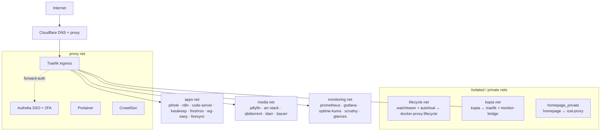

# Server Homelab

Docker-based homelab managed as infrastructure-as-code with **Ansible**. ~40 containerized
services across two hosts, fronted by **Traefik** with **Authelia** SSO, secrets encrypted
with **SOPS/age**, and reverse-proxied behind **Cloudflare**.

> Day-to-day conventions and the agent contract live in [`CLAUDE.md`](CLAUDE.md). Most
> directories and many roles have their own `CLAUDE.md` with role-specific notes.

## Hosts

| Host | Role | Notes |
|------|------|-------|
| `daniel-server` | Main server | Intel XE iGPU (Jellyfin/Tdarr transcode), LVM storage. Internet-exposed via Cloudflare. |
| `daniel-pi` | Raspberry Pi | **LAN-only**, never internet-exposed. WireGuard endpoint + a small LAN utility stack (Glances, Dozzle). |

## Repository layout

```
ansible/          # Playbooks, roles, inventory, templates   ← EDIT HERE
  deploy.yml          # Container deploy playbook (dependency-ordered)
  initial_setup.yml   # Host hardening / bootstrap
  roles/containers/   # One role per service (+ a shared `common` role)
  filter_plugins/     # Custom dependency-resolution filters (toposort.py)
  inventory/          # hosts.ini, group_vars/all.yml, host_vars/<host>.yml
  vars/secrets.yml    # SOPS-encrypted secrets
containers/       # Rendered docker-compose.yml files          ← GENERATED, do not edit
scripts/          # Helper scripts (template validation, …)
docs/             # Runbooks, design specs, security notes
```

`containers/` is produced by Ansible from the role templates — edits there are overwritten
on the next deploy. Always change `ansible/roles/containers/<svc>/templates/` instead.

## Network segmentation

Every service joins only the Docker networks it needs. Traefik is the single ingress;
Authelia gates protected routes via forward-auth.



## How deploys work

`deploy.yml` doesn't deploy roles in list order — it resolves a **dependency graph** first
(custom filters in `ansible/filter_plugins/toposort.py`):

1. Each role declares upstreams in `meta/deps.yml` (`role_deps:`).
2. `build_dep_map` loads those (only the relevant closure for a tagged run).
3. `toposort_containers` orders services so dependencies come up first.
4. For a tagged run (`--tags sonarr`), `dep_closure` + `expand_with_deps` pull up any
   **down** dependencies while skipping ones already running.

These filters are unit-tested (`ansible/tests/test_toposort.py`) — run via the `pytest`
pre-commit hook.

```bash
ansible-playbook ansible/deploy.yml --tags "<service>"          # deploy one service (+ unmet deps)
ansible-playbook ansible/deploy.yml --tags "<service>" --check  # dry run
ansible-playbook ansible/deploy.yml                             # deploy everything
ansible-playbook ansible/initial_setup.yml                      # host bootstrap/hardening
```

## Cross-cutting systems

- **Secrets** — `ansible/vars/secrets.yml`, encrypted with SOPS + age (`.sops.yaml`
  auto-encrypts anything under `vars/`/`secrets/`). Decrypted at runtime via the
  `community.sops` lookup. Edit with `sops ansible/vars/secrets.yml`. **Never commit
  plaintext secrets** — gitleaks runs pre-commit. The age private key is backed up
  out-of-band (single point of recovery).
- **Observability** — Prometheus scrapes node-exporter / cAdvisor / Traefik / CrowdSec;
  Grafana (datasources + dashboards [provisioned as code](ansible/roles/containers/grafana/));
  Loki + Promtail for logs; Uptime Kuma (monitors auto-created from AutoKuma labels);
  `monitor-bridge` turns Prometheus/Kopia signals into Uptime Kuma push alerts (backup
  freshness, disk, cert, memory, container restarts/OOM, CPU throttling, scrape-target down,
  Traefik 5xx).
- **Backups** — Kopia snapshots the bind-mounted service data under `containers/`. Services
  must use `./data` bind mounts (named volumes escape Kopia's scope); `.kopiaignore` is
  anchored to `/data/`.
- **Updates** — Watchtower auto-updates mutable `:latest` images; **Renovate** opens PRs for
  version-pinned images and the pinned `prek.toml` hook revisions (see
  [`renovate.json`](renovate.json)). Renovate requires installing the Renovate GitHub App on
  the repo once.
- **Security** — Authelia SSO + TOTP, CrowdSec, fail2ban, UFW (default-deny inbound),
  source-route rejection. See [`docs/security-tools.md`](docs/security-tools.md).

## Quality gates (pre-commit)

The repo uses [`prek`](https://prek.j178.dev) (`prek.toml`): YAML lint, `ansible-lint`,
`gitleaks`, rendered-compose validation, and the `pytest` suite.

```bash
prek run --all-files
```

## Adding a service

`ansible/roles/containers/` + the `new-container` workflow scaffold a role: a
`tasks/main.yml`, a `templates/docker-compose.yml.j2` (Traefik + AutoKuma labels, healthcheck,
resource limits), an entry in `host_vars/<host>.yml` `containers_list`, and any secrets. See
`CLAUDE.md` → "Adding a New Container Service".
