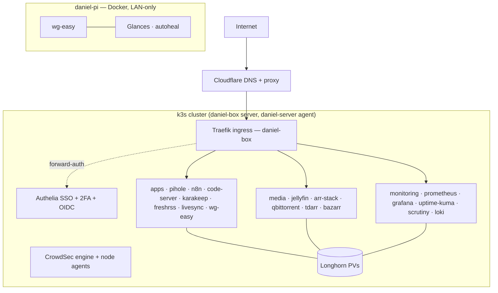

# Server Homelab

A **k3s** homelab managed as infrastructure-as-code with **Ansible**, with a small residual
**Docker** footprint on the Pi. Services are fronted by **Traefik** with **Authelia** SSO,
secrets encrypted with **SOPS/age**, storage on **Longhorn**, and reverse-proxied behind
**Cloudflare**.

<!-- The exact count is whatever `containers_list` says in inventory/host_vars/*.yml — don't
     restate a precise number here or in CLAUDE.md; two hand-maintained copies drift apart
     (they read 44 and 49 while the real total was 52). -->

```bash
grep -c '^  - name:' ansible/inventory/host_vars/*.yml   # the actual per-host tally
```

> Day-to-day conventions and the agent contract live in [`CLAUDE.md`](CLAUDE.md). Most
> directories and many roles have their own `CLAUDE.md` with role-specific notes.

The migration from Docker Compose to k3s completed on **2026-08-14**, when Docker was
uninstalled from `daniel-server`. The slice-by-slice record is in
[`docs/archive/k3s-migration/`](docs/archive/k3s-migration/) — those documents are historical and describe
work already executed.

## Hosts

| Host | Role | Notes |
|------|------|-------|
| `daniel-box` | k3s server (control plane) | Runs almost every workload. Traefik edge, Authelia SSO + OIDC issuer, Pi-hole DNS, Longhorn storage, CrowdSec. Internet-exposed via Cloudflare, and the **public WireGuard endpoint** (wg-easy, 51820/udp — the router forward moved here). Ansible runs *on* this host. |
| `daniel-server` | k3s agent node | Intel XE iGPU (Jellyfin/Tdarr transcode), LVM storage, UPS hardware + the NUT shutdown chain. **Docker uninstalled 2026-08-14** — it hosts no Compose services. |
| `daniel-pi` | Raspberry Pi — Docker | **LAN-only**, never internet-exposed or on the tunnel. A second, LAN-only wg-easy (51822/udp) + a small utility stack (Glances, autoheal, docker-proxy). The only remaining Docker host. |

## Repository layout

```
ansible/          # Playbooks, roles, inventory, templates   ← EDIT HERE
  deploy.yml          # Deploy playbook — a Docker play (dependency-ordered) + a k8s play
  k3s-bringup.yml     # Cluster foundation (k3s, Longhorn, Traefik CRDs, …)
  initial_setup.yml   # Host hardening / bootstrap
  roles/k8s/          # One role per k8s workload (manifests rendered from templates)
  roles/containers/   # One role per Docker service (+ a shared `common` role)
    archive/          # Roles retired by the k3s migration, kept for reference
  filter_plugins/     # Custom dependency-resolution filters (toposort.py)
  inventory/          # hosts.ini, group_vars/all.yml, host_vars/<host>.yml
  vars/secrets.yml    # SOPS-encrypted secrets
scripts/          # Helper scripts (template validation, …)
docs/             # Runbooks, design specs, security notes
  archive/            # Superseded planning docs (incl. the Docker → k3s migration)
```

**`containers/` is not in this repo.** It is a *runtime* directory Ansible renders on the
target host (`/home/<user>/server/containers/<svc>/docker-compose.yml`) and is untracked —
`git ls-files containers/` returns nothing. Post-migration it exists only on `daniel-pi`;
neither cluster node has one, since neither runs Docker. Edits there are overwritten on the
next deploy: always change `ansible/roles/containers/<svc>/templates/` instead. The cluster's
equivalent is the manifests rendered from `ansible/roles/k8s/`.

## Ingress and segmentation

Traefik is the single ingress on `daniel-box`, routing to workloads via Traefik
`IngressRoute` CRDs; Authelia gates protected routes via forward-auth middleware and issues
OIDC tokens for apps that speak it. Cloudflare proxies the public hostnames; `*.local.<domain>`
names are resolved by Pi-hole on the LAN and are not exposed.


```mermaid
flowchart TD
    net[Internet] --> cf[Cloudflare DNS + proxy]
    cf --> traefik[Traefik ingress — daniel-box]
    traefik -. forward-auth .-> authelia[Authelia SSO + 2FA + OIDC]

    subgraph cluster["k3s cluster (daniel-box server, daniel-server agent)"]
      traefik
      authelia
      crowdsec[CrowdSec engine + node agents]
      apps["apps · pihole · n8n · code-server · karakeep · freshrss · livesync · wg-easy"]
      media["media · jellyfin · arr-stack · qbittorrent · tdarr · bazarr"]
      monitoring["monitoring · prometheus · grafana · uptime-kuma · scrutiny · loki"]
      longhorn[(Longhorn PVs)]
    end

    traefik --> apps
    traefik --> media
    traefik --> monitoring
    apps --- longhorn
    media --- longhorn
    monitoring --- longhorn

    subgraph pi["daniel-pi — Docker, LAN-only"]
      wg[wg-easy] --- glances[Glances · autoheal]
    end
```

Network segmentation is **not** blanket-enforced: only a few roles define NetworkPolicies
(`n8n`, `prowlarr`, `registry`) — everything else is reachable pod-to-pod within the
namespace. Where policies do exist, **ingress** rules are enforced; **egress** rules are
**not** enforced by this cluster's CNI, so never read an egress policy as a control.

## How deploys work

`deploy.yml` runs two plays over the host's `containers_list`, split by each entry's
`platform:` key:

- **Docker play** (`platform: docker`, effectively just the Pi) — doesn't deploy roles in
  list order; it resolves a **dependency graph** first (custom filters in
  `ansible/filter_plugins/toposort.py`):
  1. Each role declares upstreams in `meta/deps.yml` (`role_deps:`).
  2. `build_dep_map` loads those (only the relevant closure for a tagged run).
  3. `toposort_containers` orders services so dependencies come up first.
  4. For a tagged run (`--tags sonarr`), `dep_closure` + `expand_with_deps` pull up any
     **down** dependencies while skipping ones already running.

  These filters are unit-tested (`ansible/tests/deploy/test_toposort.py`) — run via the `pytest`
  pre-commit hook.

- **k8s play** (`platform: k8s`) — includes `roles/k8s/<name>` in **list order**. There is
  no toposort here: the order in `host_vars/daniel-box.yml` is load-bearing, because the
  `traefik` role installs the CRDs every later `IngressRoute` depends on, and `authelia`
  creates the middleware other routes reference.

Both plays run against the host named by `-e target=` — but `daniel-server` and `daniel-box`
are `ansible_connection=local` in `hosts.ini`, so `-e target=` only selects whose *variables*
to use while tasks still execute locally. A pre-task refuses that case outright. Only
`daniel-pi` is genuinely remote, so `-e target=daniel-pi` works as it reads.

```bash
uv run ansible-playbook ansible/deploy.yml --tags "<service>"          # deploy one service (+ unmet deps)
uv run ansible-playbook ansible/deploy.yml --tags "<service>" --check  # dry run
uv run ansible-playbook ansible/deploy.yml                             # deploy everything
uv run ansible-playbook ansible/deploy.yml --tags "<service>" -e target=daniel-pi
uv run ansible-playbook ansible/k3s-bringup.yml                        # cluster foundation
uv run ansible-playbook ansible/initial_setup.yml                      # host bootstrap/hardening
```

First-host bring-up (uv → SOPS onboarding → `initial_setup.yml`) is ordered in
[`ansible/README.md`](ansible/README.md); [`ansible/bring-up.sh`](ansible/bring-up.sh) drives
those steps (`--scaffold` for inventory, no flag for uv + SOPS, `--continue` for the
playbooks). The manual post-deploy setup Ansible can't do is verified by
`uv run python scripts/diagnostics/postflight.py`.

## Cross-cutting systems

- **Secrets** — `ansible/vars/secrets.yml`, encrypted with SOPS + age (`.sops.yaml`
  auto-encrypts anything under `vars/`/`secrets/`). Decrypted at runtime via the
  `community.sops` lookup. Edit with `sops ansible/vars/secrets.yml`. **Never commit
  plaintext secrets** — gitleaks runs pre-commit. The age private key is backed up
  out-of-band (single point of recovery).
- **Observability** — the Prometheus / Grafana / Loki / Tempo stack runs in-cluster from
  `ansible/roles/k8s/claude-otel/`, alongside `roles/k8s/loki-homelab` (Loki + a Promtail
  DaemonSet) for homelab logs. Prometheus scrapes node-exporter / cAdvisor / Traefik /
  CrowdSec. Grafana dashboards stay provisioned as code from
  [`roles/k8s/claude-otel/files/dashboards/`](ansible/roles/containers/grafana/) — that
  tree is the single source of truth and is mounted into the cluster Grafana, which is why
  the role survives the migration despite not being in any `containers_list`. Uptime Kuma
  takes monitors from AutoKuma labels and a static-monitors Secret; `monitor-bridge` turns
  Prometheus/Longhorn signals into Uptime Kuma push alerts (backup freshness, disk, cert,
  memory, restarts/OOM, CPU throttling, scrape-target down, Traefik 5xx).
- **Backups** — Longhorn takes scheduled volume backups to **Backblaze B2**; the per-volume
  tier (daily / weekly / no-backup) and its rationale are in
  [`docs/longhorn-backup-tiering.md`](docs/longhorn-backup-tiering.md). Recovery procedure:
  [`docs/longhorn-disaster-recovery.md`](docs/longhorn-disaster-recovery.md). The Pi's own
  data is covered by `pi-peer-backup`. **Kopia is retired** (2026-08-13; repo deleted
  2026-08-14) — [`docs/kopia-disaster-recovery.md`](docs/kopia-disaster-recovery.md) is kept
  only as history.
- **Updates** — **Renovate** opens PRs for version-pinned images and the pinned `prek.toml`
  hook revisions (see [`renovate.json`](renovate.json)); it requires installing the Renovate
  GitHub App on the repo once. Watchtower was retired with the migration — image updates are
  PR-driven, not automatic.
- **Security** — Authelia SSO + TOTP + OIDC, CrowdSec (cluster engine + per-node agents),
  fail2ban, UFW (default-deny inbound), source-route rejection. See
  [`docs/security-tools.md`](docs/security-tools.md).

## Quality gates (pre-commit)

The repo uses [`prek`](https://prek.j178.dev) (`prek.toml`): YAML/JSON lint, `ansible-lint`,
`gitleaks`, rendered-template validation (compose + config + Home Assistant + Grafana),
secret-rotation-registry sync, `ruff` (lint + format), and the `pytest` suite.

```bash
prek run --all-files
```

## Adding a service

Almost every new service is a **k8s** workload: add a role under `ansible/roles/k8s/<name>/`
rendering its manifests (Deployment/Service/IngressRoute/PVC), then an entry in
`host_vars/daniel-box.yml` `containers_list` with `platform: k8s` — placed *after* anything
it depends on, since that play has no toposort. Deploy tags derive from the name.

For the Pi's Docker services, `ansible/roles/containers/` + the `new-container` workflow
scaffold a role: a `tasks/main.yml`, a `templates/docker-compose.yml.j2` (Traefik + AutoKuma
labels, healthcheck, resource limits), an entry in `host_vars/daniel-pi.yml`
`containers_list`, and any secrets. See `CLAUDE.md` → "Adding a New Container Service".
