# Topology

How a request reaches a workload, and what it runs on.

The diagram's *shape* is fixed. The request path, the two cluster nodes, the Longhorn backup
chain and the Pi's LAN-only plane live in role templates and Traefik middleware rather than in
`containers_list`, so they cannot be derived. Every name, address, count and status colour on it
is read from the inventory and the live cluster.

A box whose status colour reads unknown was not reachable when the diagram was generated. The
render degrades to declared-only rather than failing, so a partial map is expected after a
cluster restart and is not itself a fault.

This page is prose around a generated image: only the SVG regenerates. The image is written by
`scripts/gen_infra_map.py --format svg`; the same script's default HTML output is the standalone
artifact page at `~/.claude/artifacts/homelab-infra-map.html`, which carries the live-state
tables this page does not.
